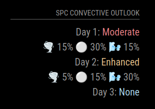

# MMM-SPCOutlook
SPC Point-in-Polygon check for location in Outlooks

## Multiple instances

MagicMirror runs one `node_helper` per module *type*, and a socket broadcast from it
reaches every configured instance of that type. This module therefore supports **one
configured instance**. If two are configured at different `lat`/`lon`, only the first
location is polled: the second instance discards the payloads it receives (they are
addressed to the other instance's coordinates) and stays on "Loading SPC Outlook...".
Both ends log a warning naming the two locations when this is detected.

Rendering the other instance's outlook would be worse than rendering nothing — a viewer
watching the wrong city's tornado risk has no way to tell.
